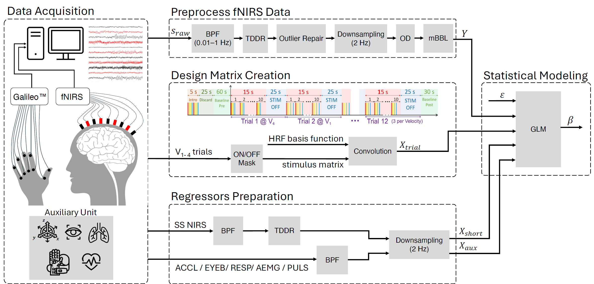
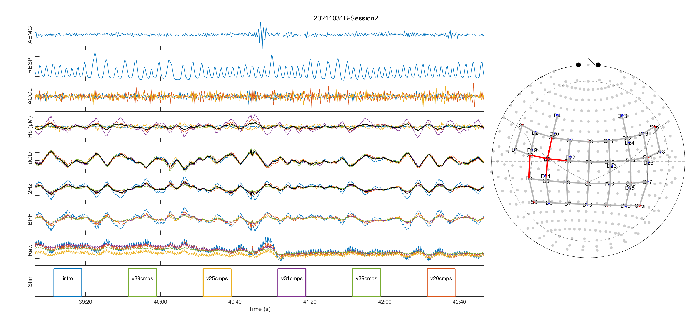

# TacVel-fNIRS
Somatosensory Hemodynamic response to Tactile Stimulation at different Velocities as Measured by functional Near-Infrared Spectroscopy

<p>
  
  <strong> Code based on MATLAB R2023b</strong>
</p>


# summary of the piplines
xxxxxxxxxxxxxxxx




<!--
<p align="center">
  
</p>
-->
xxxxxx

<table>
  <tr>
    <td></td>
    <td></td>
  </tr>
</table>


## Setup the code
 Clone the repository and change your working directory to the TacVel-fNIRs path. 
 ```
cd <directory you want to place the repo>
git clone <https://github.com/mhozan/TacVel-fNIRS.git>
cd TacVel-fNIRS
```

The cloned repo ..... Now move the ```+cnl``` folder as follows.
```
mv source_folder target_folder/
```

